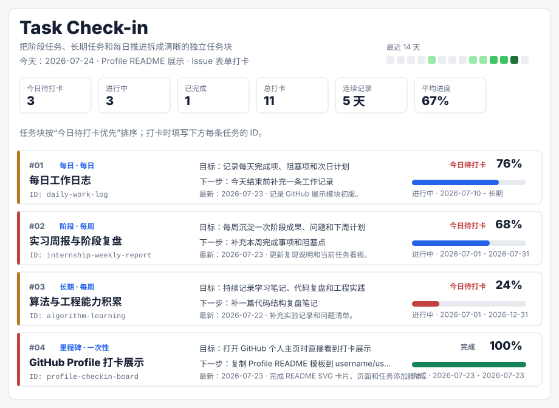

# AlphaCV

### Task Check-in Hub

Track stage goals, long-term work, and daily progress directly on GitHub.

 
 

 

Issue Forms record tasks and check-ins. GitHub Actions refresh the SVG automatically.

